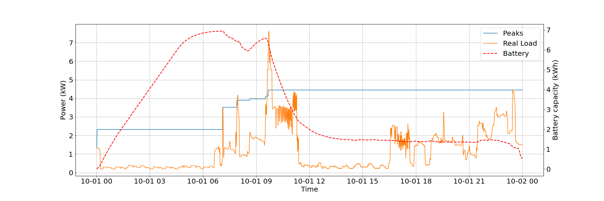

# DP_Project
This is a repository for course project in [SC42110 Dynamic Programming and Stochastic Control](https://www.dcsc.tudelft.nl/~mohajerin/DP.html). The project solves a battery management problem which is commonly described as "Peak shaving" problem.

## Usage
To understand what's going on, please have a look at `main.ipynb`. It contains many explanations along with the code.

To do DP experiments with high resolution, run
```
. do_DP.bash
```

## Result


## Data source
This dataset is made available under the “Creative Commons Attribution 4.0 International (CC BY 4.0)” license.

Original data source from:
https://archive.ics.uci.edu/ml/datasets/individual+household+electric+power+consumption

by Georges Hebrail (georges.hebrail '@' edf.fr), Senior Researcher, EDF R&D, Clamart, France
Alice Berard, TELECOM ParisTech Master of Engineering Internship at EDF R&D, Clamart, France

Modifications to the dataset:
The dataset is pruned to contain one year starting from October 2007 until October 2008, and missing values were replaced by neighbouring values.
The first column is the date in dd-mm-yyyy format, the second column is time in hh:mm:ss format, and the third column is the electrical load at the specific time in kW.

## Dependency
```
joblib==1.1.0
numpy==1.19.5
Policy==1.0.0
pyzmq==23.2.0
torch==1.10.2
tqdm==4.64.0
```
